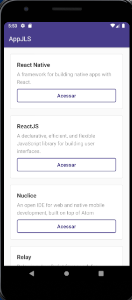

# reactNativeBasico
## Primeira aplicação feita em React Native através de um curso básico provido pela Rocketseat.

### Tela principal do aplicativo, em que lista tecnologias de uma API em NodeJS externa.

### Tela que exibe uma WebView após clicar no botão 'Acessar' na tela principal que direciona para o GitHub da tecnologia selecionada.

